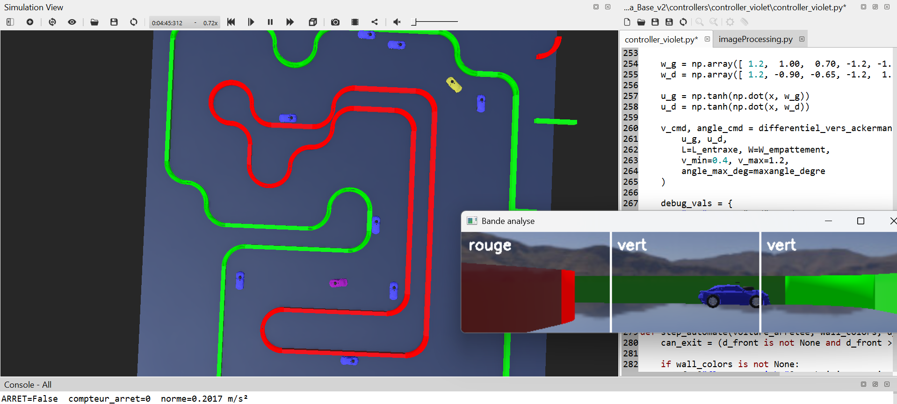

# Simulation Voiture Autonome – Webots

##  Description

Ce projet correspond à une **simulation Webots d’une voiture autonome** utilisant :

- LiDAR pour la perception
- Caméra + OpenCV pour la détection de couleurs
- Un contrôleur basé sur un réseau de neurones (ANN)

La logique globale est similaire à celle utilisée sur la voiture réelle (déjà détaillée dans la branche main).

---

##  Structure du projet

###  worlds/
Contient la **piste de simulation** (environnements Webots).

---

###  protos/
Contient le **modèle du robot (Tamiya TT02)** utilisés dans la simulation.

---

###  controllers/
Contient le **code de contrôle de la voiture** :

- `controller_violet.py`  
  → Contrôleur principal (capteurs + ANN + commande du véhicule)

- `imageProcessing.py`  
  → Traitement d’image (détection rouge / vert avec OpenCV)

---

##  Aperçu

---

##  Commandes

- `A` → Activer mode autonome  
- `N` → Arrêter  
- `T` → Mode test caméra  

---

##  Lancement

1. Ouvrir le projet dans Webots  
2. Charger un monde depuis `worlds/`  
3. Lancer la simulation  
4. Appuyer sur `A`  

---

##  Remarque

Ce dépôt correspond à la **version simulation uniquement**.  
Les détails complets sont disponibles dans la branche dédiée à la voiture réelle.
